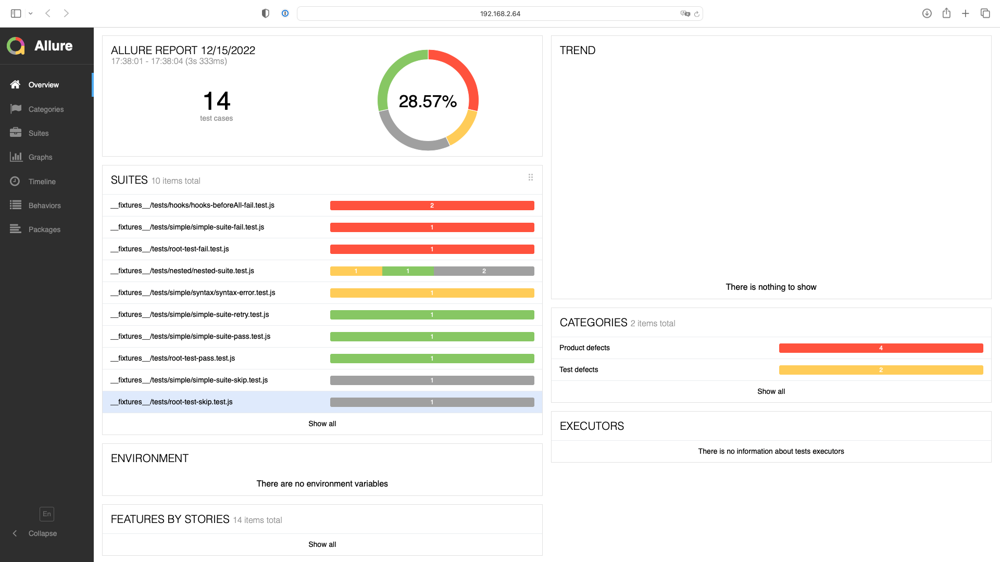

# jest-allure2-reporter

[](https://badge.fury.io/js/jest-allure2-reporter)
[](https://github.com/wix-incubator/jest-allure2-reporter/actions/workflows/ci.yml)
[](https://github.com/semantic-release/semantic-release)
[](http://commitizen.github.io/cz-cli/)



## Installation

Before you start, make sure you have [Allure CLI](https://docs.qameta.io/allure/#_get_started) installed.

Your project should have [`jest`](https://jestjs.io) installed. The minimum supported version is `27.x`.

Run in your project:

```bash
npm install --save-dev jest-allure2-reporter
```

Edit your `jest.config.js`:

```diff
module.exports = {
  // ...
  reporters: [
    'default',
+   'jest-allure2-reporter',
  ],
};
```

## Customization

By default, the reporter will write the results to `allure-results` directory. You can change this by setting the `resultsDir` option:

```diff
module.exports = {
  // ...
  reporters: [
    'default',
    [
      'jest-allure2-reporter',
+     { resultsDir: 'my-results-dir' },
    ],
  ],
};
```

Below is a list of all the available options:

| Property                   | Type                     | Default                          | Description                                                                                                                                                                                                                                |
|----------------------------|--------------------------|----------------------------------|--------------------------------------------------------------------------------------------------------------------------------------------------------------------------------------------------------------------------------------------|
| `errorsAsFailedAssertions` | `boolean`                | `false`                          | Treat thrown errors as failed assertions. By default, the reporter distinguishes between failed assertions and thrown errors. The former are reported as FAILED tests, the latter as BROKEN tests.                                         |
| `getEnvironmentInfo`       | `function` or `boolean`  | `true`                           | Can be customized with an async function to extract environment information from the test environment. By default, the environment information is extracted from the `process.env` object. Use `false` to disable environment information. |
| `overwriteResultsDir`      | `boolean`                | `true`                           | Whether the reporter should delete the results directory before running tests.                                                                                                                                                             |
| `packageName`              | `string`                 | `require('./package.json').name` | Add an extra label to each test case with the package name. Helpful when running tests from multiple packages in a monorepo.                                                                                                               |
| `resultsDir`               | `string`                 | `<rootDir>/allure-results`       | Path to the directory where the report will be generated.                                                                                                                                                                                  |

## Usage

Run your tests with `jest` as usual and then view the results:

```bash
allure serve
```

If you use a custom `resultsDir`, you should specify it in the `allure serve` command, e.g.:

```bash
allure serve your-results-dir # if you use a custom `resultsDir`
```

If you want to generate a static report, e.g., for CI, run:

```bash
allure generate
```

For more information, see the [Allure CLI documentation](https://docs.qameta.io/allure/#_get_started).

## Contributing

See [CONTRIBUTING.md](CONTRIBUTING.md).

## License

[MIT License](LICENSE)
