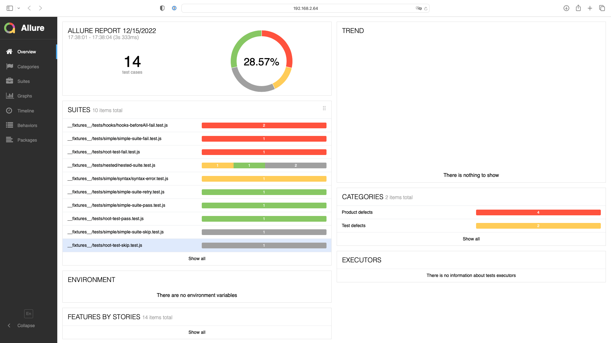

[](https://stand-with-ukraine.pp.ua)

<div align="center">


# jest-allure2-reporter

Idiomatic Jest reporter for Allure Framework

[](https://badge.fury.io/js/jest-allure2-reporter)
[](https://github.com/wix-incubator/jest-allure2-reporter/actions/workflows/ci.yml)
[](https://github.com/semantic-release/semantic-release)
[](http://commitizen.github.io/cz-cli/)

</div>

## Installation

> This is an express guide to get you started quickly. Please visit [our documentation website] for more information.

Your project should have [`jest`] installed. The minimum supported version is `27.x`.

Run in your project:

```bash
npm install --save-dev jest-allure2-reporter@beta
```

Edit your Jest config, e.g. `jest.config.js`:

```diff
/** @type {import('@jest/types').Config.InitialOptions} */
module.exports = {
   // ...
   reporters: [
     'default',
+    'jest-allure2-reporter',
   ],
   // For the most of the features you'll need the custom environment:
+  testEnvironment: 'jest-allure2-reporter/environment-node',
};
```

## Usage

Run your tests with `jest` as usual, e.g.:

```bash
npm test
```

and then view the results:

```bash
ALLURE_NO_ANALYTICS=1 allure serve
```



If you need to generate a static report, e.g., on CI, run instead:

```bash
ALLURE_NO_ANALYTICS=1 allure generate
```

Make sure you have `allure` CLI installed beforehand. For more information about it, refer to the official [Allure docs].

## Contributing

See the [Contributing] guide on the website.

## License

Licensed under [MIT License].

[`jest`]: https://jestjs.io
[our documentation website]: https://wix-incubator.github.io/jest-allure2-reporter/
[Allure docs]: https://docs.qameta.io/allure/#_get_started
[Contributing]: https://wix-incubator.github.io/jest-allure2-reporter/about/contributing
[MIT License]: LICENSE
