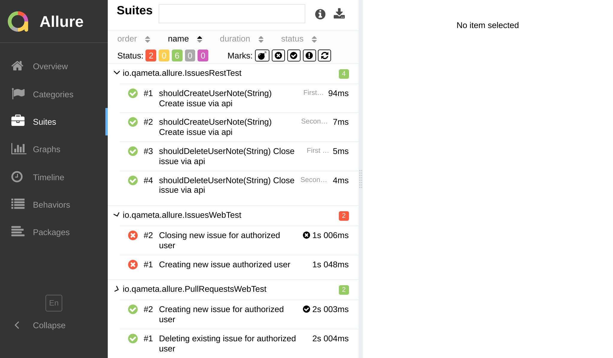
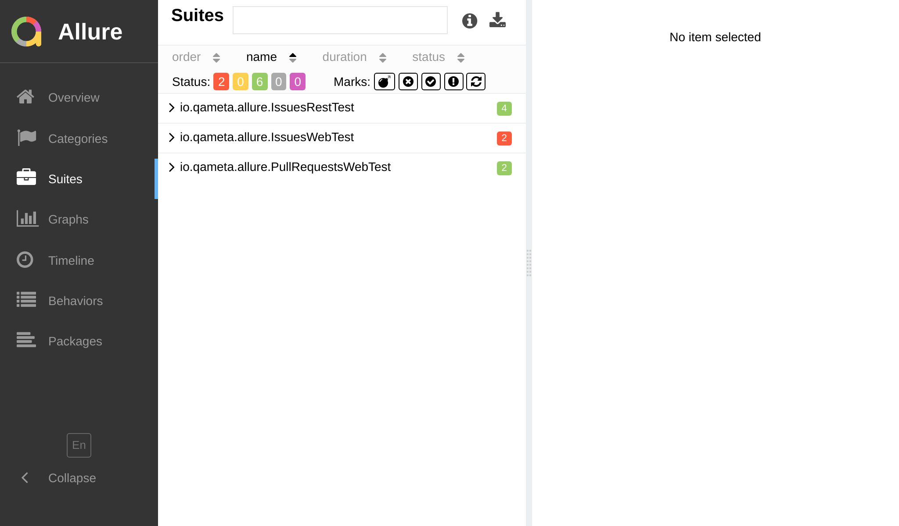

import Tabs from '@theme/Tabs';
import TabItem from '@theme/TabItem';

# Grouping

:::caution

This website version refers to the unreleased version of `jest-allure2-reporter` and is not yet available
anywhere. Please use GitHub docs for the latest stable version.

:::

Allure reports are designed to be clear and accessible to all team members, making it easier to interpret test results.

**Grouping** is a feature that allows you to view test results from different perspectives and gain insights quickly.

There are four main ways to group test results in Allure reports: **by suite**, **by severity**, **by story**, and **by defect category**.

## By Suite :star:

This is the default grouping option, and it makes the most sense for projects using Jest.



The suite hierarchy consists of up to four levels: **parent suite**, **suite**, **subsuite**, and **test case**.

:::info

<dl>
  <dt><strong>Parent Suite</strong></dt>
  <dd>The highest level of the hierarchy used to group test results by package (e.g., <code>client</code>, <code>server</code>), test directory (e.g., <code>e2e</code>, <code>unit</code>, <code>integration</code>), or any other relevant criteria. It is not configured by default, but you can easily add it to your reports.</dd>

  <dt><strong>Suite</strong></dt>
  <dd>Serves as the primary grouping level, typically based on test file paths. However, you can choose alternative criteria such as feature or component directories (<code>LoginScreen</code>, <code>ProfileScreen</code>, <code>core</code>, <code>utils</code>), or top-level describe block names, if preferred.</dd>

  <dt><strong>Subsuite</strong></dt>
  <dd>Helpful when dealing with a large number of test cases within a single suite. By default, it groups test cases based on the top-level describe block. However, alternative configurations can be explored if there are numerous nested describe blocks or a file system-based splitting is preferred.</dd>

  <dt><strong>Test Case</strong></dt>
  <dd>Represents the actual test. By default, it displays the test name, including the inner describe block names. You have the flexibility to choose a test name format that best suits your needs – see a few examples below of how to configure the grouping levels.</dd>
</dl>

:::

Below we'll explore a few examples of how to configure the grouping levels.

### Default preset

By default, `jest-allure2-reporter` provides 3 levels of grouping: **suite**, **subsuite**, and **test case**:

* The **suite** level is based on the _test file path_.
* The **subsuite** level is based on the _top-level describe block_.
* The **test case** level is based on the _test name_ (including the inner describe block names).

<Tabs groupId="grouping-default">
  <TabItem value="report" label="Report">


  </TabItem>
  <TabItem value="structure" label="Structure">

```plain
├─ client/auth/LoginScreen.test.js
│  └─ Login screen
│     ├─ when loaded should display login form
│     └─ when loaded and typed should validate e-mail
│     └─ when loaded and typed should validate password
├─ client/auth/ForgotPasswordScreen.test.js
│  └─ Forgot password screen
│     ├─ when loaded should display forgot password form
│     └─ when loaded and typed should validate e-mail
├─ server/controllers/login.test.js
|  └─ Login controller
|     ├─ should return 401 if user is not found
|     └─ should return 401 if password is incorrect
└─ server/controllers/forgotPassword.test.js
   └─ Forgot password controller
      ├─ should return 401 if user is not found
      └─ should return 401 if password is incorrect
```

  </TabItem>
  <TabItem value="config" label="Config">

```js title="jest.config.js"
/** @type {import('@jest/types').Config.InitialOptions} */
module.exports = {
  testEnvironment: 'jest-allure2-reporter/environment-node',
  reporters: [
    'default',
    'jest-allure2-reporter',
    // You don't need to configure anything special
    // to get this structure.
  ],
};
```

  </TabItem>
</Tabs>

### File-oriented example

This example might be useful for projects with many test files and relatively few test cases per file.

<Tabs groupId="grouping-default">
  <TabItem value="report" label="Report">



  </TabItem>
  <TabItem value="structure" label="Structure">

```plain
├─ client
│  └─ auth
│     ├─ LoginScreen.test.js
│     │  ├─ Login screen when loaded should display login form
│     │  ├─ Login screen when loaded and typed should validate e-mail
│     │  └─ Login screen when loaded and typed should validate password
│     └─ ForgotPasswordScreen.test.js
│        ├─ Forgot password screen when loaded should display forgot password form
│        └─ Forgot password screen when loaded and typed should validate e-mail
└─ server
   └─ controllers
      ├─ login.test.js
      │  ├─ Login controller should return 401 if user is not found
      │  └─ Login controller should return 401 if password is incorrect
      └─ ForgotPasswordScreen.test.js
         ├─ Forgot password controller should return 401 if user is not found
         └─ Forgot password controller should return 401 if password is incorrect
```

  </TabItem>
  <TabItem value="config" label="Config">

```js title="jest.config.js"
/** @type {import('@jest/types').Config.InitialOptions} */
module.exports = {
  testEnvironment: 'jest-allure2-reporter/environment-node',
  reporters: [
    'default',
    ['jest-allure2-reporter', /** @type {import('jest-allure2-reporter').Options}*/
      {
        labels: {
          parentSuite: ({ file }) => file.pathSegments[0],
          suite: ({ file }) => file.pathSegments.slice(1, -1).join(' '),
          subsuite: ({ file }) => file.pathSegments.slice(-1)[0],
          test: ({ test }) => test.fullName,
        },
      },
    ],
  ],
};
```

  </TabItem>
</Tabs>

### Test-oriented example

<Tabs groupId="grouping-default">
  <TabItem value="report" label="Report">


  </TabItem>
  <TabItem value="structure" label="Structure">

```plain
├─ client/auth/LoginScreen.test.js
│  ├─ Login screen
│  │  ├─ when loaded
│  │  │  └─ should display login form
│  │  └─ when loaded and typed
│  │     ├─ should validate e-mail
│  │     └─ should validate password
│  └─ Forgot password screen
│     ├─ when loaded
│     │  └─ should display forgot password form
│     └─ when loaded and typed
│        └─ should validate e-mail
└─ server/controllers/login.test.js
   ├─ Login controller
   │  ├─ should return 401 if user is not found
   │  └─ should return 401 if password is incorrect
   └─ Forgot password controller
      ├─ should return 401 if user is not found
      └─ should return 401 if password is incorrect
```

  </TabItem>
  <TabItem value="config" label="Config">

```js title="jest.config.js"
/** @type {import('@jest/types').Config.InitialOptions} */
module.exports = {
  testEnvironment: 'jest-allure2-reporter/environment-node',
  reporters: [
    'default',
    ['jest-allure2-reporter', /** @type {import('jest-allure2-reporter').Options}*/ {
      labels: {
        parentSuite: ({ file }) => file.path,
        suite: ({ test }) => test.ancestorTitles[0],
        subsuite: ({ test }) => test.ancestorTitles.slice(1).join(' ') || undefined,
        test: ({ test }) => test.title,
      },
    }],
  ],
};
```

  </TabItem>
</Tabs>

## By Story 📖

This grouping option stems from the [Behavior-Driven Development](https://en.wikipedia.org/wiki/Behavior-driven_development) (BDD) methodology and
allows users to group test results based on the **epic**, **feature** and **story** to which each test case belongs, where:

* **Epic** is a high-level business goal.
* **Feature** is a functionality that delivers business value.
* **Story** is a user story that describes a feature from the end-user perspective.


This grouping is not enabled by default. Moreover, you need to decide how exactly you want to enable it.

### Annotations API

The [annotation-based approach](../api/08-labels.mdx) gives you a fine-grained control over the names of your Epic, Feature and Story labels, but it requires you to add annotations to your test cases.

In the previous example, it would make sense to group both client and server tests under the same features like **Login screen** and **Forgot password screen**, whereas the epic would be **Authentication**.

<Tabs groupId="grouping-default">
  <TabItem value="report" label="Report">


  </TabItem>
  <TabItem value="structure" label="Structure">

```plain
└─ Authentication
   ├─ Login screen
   │  ├─ should validate e-mail on client
   │  ├─ should validate e-mail on server
   │  ├─ should display login form on client
   │  ├─ should return 401 if user is not found
   │  └─ should return 401 if password is incorrect
   └─ Forgot password screen
      ├─ should validate e-mail on client
      ├─ should validate e-mail on server
      ├─ should return 401 if user is not found
      └─ should return 401 if password is incorrect
```

  </TabItem>
  <TabItem value="config" label="Code">

```js title="login.test.js"
import { $Epic, $Feature, $Story } from 'jest-allure2-reporter/annotations';

$Epic('Authentication');
$Feature('Login screen');
describe('Login controller', () => {
  $Story('should validate e-mail on server');
  it('should validate e-mail', () => {
    // ...
  });

  $Story('should return 401 if user is not found');
  it('should return 401 if user is not found', () => {
    // ...
  });
});
```

  </TabItem>
</Tabs>


### Configuration API

The **configuration-based approach** allows you to group test cases based on the available attributes like file path, ancestor describe blocks, test name and so on.

It's a good option if you don't want to add annotations to your test cases by hand, but it's less flexible than the annotation-based approach. Still, it might be useful if your grouping by suite focuses mostly [on the file structure](#file-oriented-example), and you want to add "a fresh perspective" by grouping tests by describe blocks and test names, for example.

Here's a simple example where we map:

* **epic** to the top-level describe block
* **feature** to the second-level describe block
* **story** to the remaining describe blocks and test name itself

<Tabs groupId="grouping-default">
  <TabItem value="report" label="Report">


  </TabItem>
  <TabItem value="structure" label="Structure">

```plain
├─ Login screen
│  ├─ when loaded
│  │  └─ should display login form
│  └─ when loaded and typed
│     ├─ should validate e-mail
│     └─ should validate password
├─ Forgot password screen
│  ├─ when loaded
│  │  └─ should display forgot password form
│  └─ when loaded and typed
│     └─ should validate e-mail
├─ Login controller
│  ├─ should return 401 if user is not found
│  └─ should return 401 if password is incorrect
└─ Forgot password controller
   ├─ should return 401 if user is not found
   └─ should return 401 if password is incorrect
```

  </TabItem>
  <TabItem value="config" label="Config">

```js title="jest.config.js"
/** @type {import('@jest/types').Config.InitialOptions} */
module.exports = {
  testEnvironment: 'jest-allure2-reporter/environment-node',
  reporters: [
    'default',
    ['jest-allure2-reporter', /** @type {import('jest-allure2-reporter').Options}*/ {
      labels: {
        epic: ({ test }) => test.ancestorTitles[0],
        feature: ({ test }) => test.ancestorTitles.slice(1).join(' ') || undefined,
        story: ({ test }) => test.title,
      },
    }],
  ],
};
```

  </TabItem>
</Tabs>

## By Package 📦


This grouping feature is the least helpful outside of Java world, where packages are used to organize the codebase.

It strictly follows `com.example.package.ClassName` naming convention, where:

* `com.example.package` is a **package**,
* `com.example.package.ClassName` is a **test class**,
* `shouldAssertAndDoSomething` is a **test method**.

It doesn't work well with JavaScript, and, that's why you can use only two grouping levels: **package** and **test method**.

A couple of feasible options are:

* use `package` to group tests by `package.json` name;
* use `package` to group tests by the file path;
* use `testMethod` to group tests by the full test name

<Tabs groupId="grouping-default">
  <TabItem value="report" label="Report">


  </TabItem>
  <TabItem value="structure" label="Structure">

```plain
└─ @my-company/my-package
   ├─ Forgot password controller should return 401 if password is incorrect
   ├─ Forgot password controller should return 401 if user is not found
   ├─ Forgot password screen when loaded and typed should validate e-mail
   ├─ Forgot password screen when loaded should display forgot password form
   ├─ Login controller should return 401 if password is incorrect
   ├─ Login controller should return 401 if user is not found
   ├─ Login screen when loaded and typed should validate password
   ├─ Login screen when loaded and typed should validate password
   └─ Login screen when loaded should display login form
```

  </TabItem>
  <TabItem value="config" label="Config">

```js title="jest.config.js"
/** @type {import('@jest/types').Config.InitialOptions} */
module.exports = {
  testEnvironment: 'jest-allure2-reporter/environment-node',
  reporters: [
    'default',
    ['jest-allure2-reporter', /** @type {import('jest-allure2-reporter').Options}*/ {
      labels: {
        package: ({ package }) => package.name,
        // NOTE: `testClass` won't work due to the aforementioned issue
        testClass: ({ file }) => file.path,
        testMethod: ({ test }) => test.fullName,
      },
    }],
  ],
};
```

  </TabItem>
</Tabs>

## By Defect Category 🚨

Allure 2 Framework provides a way to categorize errors by defining category names and regular expressions to match against error messages.
Read more about it in the [Defect category] section.

[Defect category]: 01-grouping.mdx#defect-category

## Summary

Investing time in properly configuring the grouping options is recommended, especially for projects with a large test codebase. Grouping can significantly enhance the organization and analysis of test results, aiding in effective collaboration and debugging efforts.
