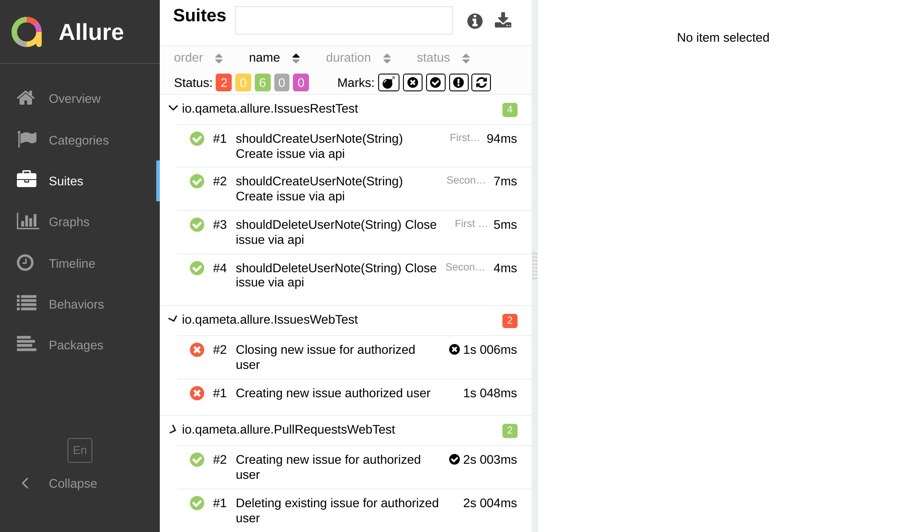
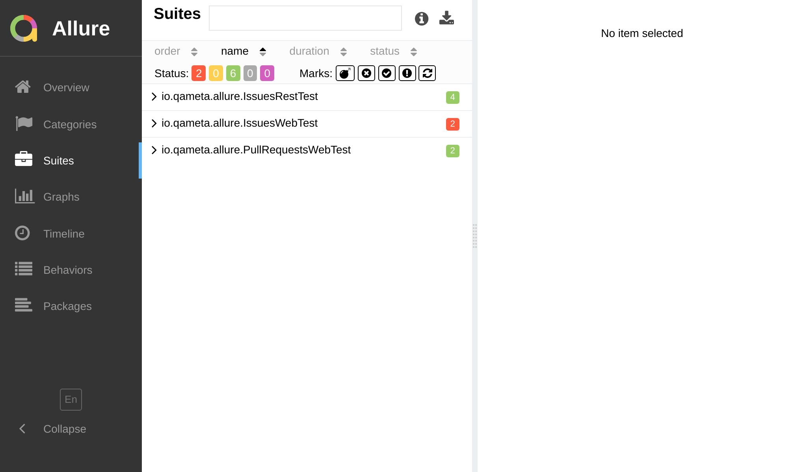

import Tabs from '@theme/Tabs';
import TabItem from '@theme/TabItem';

# By Suite

This is perhaps the most common way to group test results, and it makes the most sense for projects using Jest.



The suite hierarchy consists of up to four levels: **parent suite**, **suite**, **sub-suite** and **test case**.

:::info Glossary

<dl>
  <dt><strong>Parent Suite</strong></dt>
  <dd>The highest level of the hierarchy used to group test results by package (e.g., <code>client</code>, <code>server</code>), test directory (e.g., <code>e2e</code>, <code>unit</code>, <code>integration</code>), or any other relevant criteria. <em>It is not configured by default</em>, but you can easily add it to your reports.</dd>

  <dt><strong>Suite</strong></dt>
  <dd>Serves as the primary grouping level, typically based on test file paths. However, you can choose alternative criteria such as feature or component directories (<code>LoginScreen</code>, <code>ProfileScreen</code>, <code>core</code>, <code>utils</code>), or top-level describe block names, if preferred.</dd>

  <dt><strong>Subsuite</strong></dt>
  <dd>Helpful when dealing with a large number of test cases within a single suite. By default, test cases are grouped per top-level describe block. However, if there are numerous nested describe blocks (or, vice versa &mdash; lots of files and directories), you can look for alternative configurations.</dd>

  <dt><strong>Test Case</strong></dt>
  <dd>Represents the actual test. By default, it displays the test name, including the inner describe block names. You have the flexibility to choose a test name format that best suits your needs – see a few examples below in this article.</dd>
</dl>

:::

Below we'll explore a few examples of how to configure the grouping by suite.

## Default preset

By default, `jest-allure2-reporter` provides 3 levels of grouping: **suite**, **sub-suite**, and **test case**:

1. The **suite** level is based on the _test file path_.
1. The **sub-suite** level is based on the _top-level describe block_.
1. The **test case** level is based on the _test name_ (including the inner describe block names).

<Tabs groupId="configTab">
  <TabItem value="demo" label="Preview">


  </TabItem>
  <TabItem value="structure" label="Structure">

```plain
├─ client/auth/LoginScreen.test.js
│  └─ Login screen
│     ├─ when loaded should display login form
│     └─ when loaded and typed should validate e-mail
│     └─ when loaded and typed should validate password
├─ client/auth/ForgotPasswordScreen.test.js
│  └─ Forgot password screen
│     ├─ when loaded should display forgot password form
│     └─ when loaded and typed should validate e-mail
├─ server/controllers/login.test.js
|  └─ Login controller
|     ├─ should return 401 if user is not found
|     └─ should return 401 if password is incorrect
└─ server/controllers/forgotPassword.test.js
   └─ Forgot password controller
      ├─ should return 401 if user is not found
      └─ should return 401 if password is incorrect
```

  </TabItem>
  <TabItem value="config" label="Config">

```js title="jest.config.js"
/** @type {import('@jest/types').Config.InitialOptions} */
module.exports = {
  testEnvironment: 'jest-allure2-reporter/environment-node',
  reporters: [
    'default',
    'jest-allure2-reporter',
    // You don't need to configure anything special
    // to get this structure.
  ],
};
```

  </TabItem>
</Tabs>

## File-oriented example

This example might be useful for projects with many test files and relatively few test cases per file.

<Tabs groupId="configTab">
  <TabItem value="demo" label="Preview">



  </TabItem>
  <TabItem value="structure" label="Structure">

```plain
├─ client
│  └─ auth
│     ├─ LoginScreen.test.js
│     │  ├─ Login screen when loaded should display login form
│     │  ├─ Login screen when loaded and typed should validate e-mail
│     │  └─ Login screen when loaded and typed should validate password
│     └─ ForgotPasswordScreen.test.js
│        ├─ Forgot password screen when loaded should display forgot password form
│        └─ Forgot password screen when loaded and typed should validate e-mail
└─ server
   └─ controllers
      ├─ login.test.js
      │  ├─ Login controller should return 401 if user is not found
      │  └─ Login controller should return 401 if password is incorrect
      └─ ForgotPasswordScreen.test.js
         ├─ Forgot password controller should return 401 if user is not found
         └─ Forgot password controller should return 401 if password is incorrect
```

  </TabItem>
  <TabItem value="config" label="Config">

```js title="jest.config.js"
/** @type {import('@jest/types').Config.InitialOptions} */
module.exports = {
  testEnvironment: 'jest-allure2-reporter/environment-node',
  reporters: [
    'default',
    ['jest-allure2-reporter',
      /** @type {import('jest-allure2-reporter').ReporterOptions}*/
      {
        testCase: {
          name: ({ testCase }) => [
            ...testCase.ancestorTitles,
            testCase.title
          ].join(' » '),
          labels: {
            parentSuite: ({ filePath }) => file.pathSegments[0],
            suite: ({ filePath }) => file.pathSegments[1],
            subSuite: ({ filePath }) => file.pathSegments.slice(2).join('/'),
          },
        },
      },
    ],
  ],
};
```

  </TabItem>
</Tabs>

## Test-oriented example

This example should fit projects with a smaller number of test files and numerous test cases per file.

<Tabs groupId="configTab">
  <TabItem value="demo" label="Preview">


  </TabItem>
  <TabItem value="structure" label="Structure">

```plain
├─ client/auth/LoginScreen.test.js
│  ├─ Login screen
│  │  ├─ when loaded
│  │  │  └─ should display login form
│  │  └─ when loaded and typed
│  │     ├─ should validate e-mail
│  │     └─ should validate password
│  └─ Forgot password screen
│     ├─ when loaded
│     │  └─ should display forgot password form
│     └─ when loaded and typed
│        └─ should validate e-mail
└─ server/controllers/login.test.js
   ├─ Login controller
   │  ├─ should return 401 if user is not found
   │  └─ should return 401 if password is incorrect
   └─ Forgot password controller
      ├─ should return 401 if user is not found
      └─ should return 401 if password is incorrect
```

  </TabItem>
  <TabItem value="config" label="Config">

```js title="jest.config.js"
/** @type {import('@jest/types').Config.InitialOptions} */
module.exports = {
  testEnvironment: 'jest-allure2-reporter/environment-node',
  reporters: [
    'default',
    ['jest-allure2-reporter', /** @type {import('jest-allure2-reporter').ReporterOptions}*/ {
      labels: {
        parentSuite: ({ file }) => file.path,
        suite: ({ test }) => test.ancestorTitles[0],
        subSuite: ({ test }) => test.ancestorTitles.slice(1).join(' ') || undefined,
        test: ({ test }) => test.title,
      },
    }],
  ],
};
```

  </TabItem>
</Tabs>

