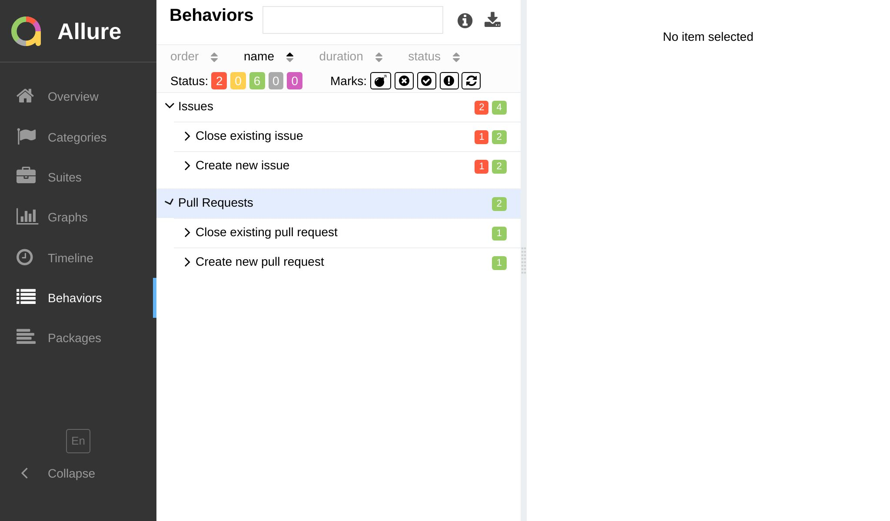
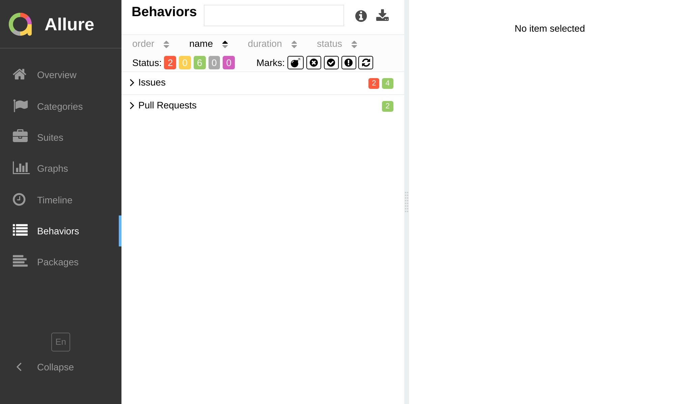

import Tabs from '@theme/Tabs';
import TabItem from '@theme/TabItem';

# By Story

:::caution

This website version refers to the unreleased version of `jest-allure2-reporter` and is not yet available
anywhere. Please use GitHub docs for the latest stable version.

:::


This grouping option is a concept that comes from the [Behavior-Driven Development](https://en.wikipedia.org/wiki/Behavior-driven_development) (BDD) methodology.
Unlike the [suite-based grouping](01-by-suite.mdx), which is based on the technical structure of your test suite, the story-based grouping
helps you to focus on the business value of your tests and view them from the end-user perspective.



The story-oriented hierarchy has 4 mandatory levels: **epic**, **feature**, **story** and **test case**.

:::info Glossary

<dl>
  <dt><strong>Epic</strong></dt>
  <dd>High-level business goal</dd>

  <dt><strong>Feature</strong></dt>
  <dd>Functionality that delivers business value</dd>

  <dt><strong>Story</strong></dt>
  <dd>User story that describes a feature from the end-user perspective</dd>

  <dt><strong>Test Case</strong></dt>
  <dd>Atomic, lowest-level unit. In Jest, it is a single <code>it</code> or <code>test</code> function.</dd>
</dl>

:::

Before you start using this grouping option, you need to decide how exactly you want to implement it:

* via [annotations](#annotations-api) – a more granular approach, which allows you to control the grouping on a per-test basis;
* via [configuration](#configuration-api) – a quick option to enable it all at once, based on general rules;
* via _mixing these approaches_ – a compromise between the two, where the configuration serves as a fallback for missing annotations.

## Annotations API

The [annotation-based approach](../../api/08-labels.mdx) gives you a fine-grained control over the names of your epic, feature and story labels, but it requires you to add annotations to _every and each test case_ (sic!) which can be tedious.

Let's take the same project as in the previous article, where there are two parts: client and server.
Both them deal with the same functionality – authentication and restoring forgotten passwords.
Hence, it would make sense to group both client and server tests under the same epic named **Authentication**, and continue grouping them by features and stories regardless of the application layer.

<Tabs groupId="configTab">
  <TabItem value="demo" label="Report">



  </TabItem>
  <TabItem value="structure" label="Structure">

```plain
└─ Authentication
   ├─ Login screen
   │  ├─ should validate e-mail on client
   │  ├─ should validate e-mail on server
   │  ├─ should display login form on client
   │  ├─ should return 401 if user is not found
   │  └─ should return 401 if password is incorrect
   └─ Forgot password screen
      ├─ should validate e-mail on client
      ├─ should validate e-mail on server
      ├─ should return 401 if user is not found
      └─ should return 401 if password is incorrect
```

  </TabItem>
  <TabItem value="config" label="Code">

```js title="login.test.js"
import { $Epic, $Feature, $Story } from 'jest-allure2-reporter/annotations';

$Epic('Authentication');
$Feature('Login screen');
describe('Login controller', () => {
  $Story('should validate e-mail on server');
  it('should validate e-mail', () => {
    // ...
  });

  $Story('should return 401 if user is not found');
  it('should return 401 if user is not found', () => {
    // ...
  });
});
```

  </TabItem>
</Tabs>

As mentioned before, the annotation-based approach requires you to annotate literally **every test case** with all
the three labels (epic, feature and story), otherwise the report will be stubbornly displaying a flat structure in **Behaviors** section.

:::tip

To relax the requirement to annotate all your test cases, you can add a fallback via configuration, e.g.:

```js title="jest.config.js"
/** @type {import('@jest/types').Config.InitialOptions} */
module.exports = {
  testEnvironment: 'jest-allure2-reporter/environment-node',
  reporters: [
    'default',
    ['jest-allure2-reporter', /** @type {import('jest-allure2-reporter').Options}*/ {
      labels: {
        epic: ({ value }) => value ?? 'Uncategorized',
        feature: ({ value }) => value ?? 'Untitled feature',
        story: ({ value }) => value ?? 'Untitled story',
      },
    }],
  ],
};
```

:::

## Configuration API

The **configuration-based approach** allows you to group test cases based on the available attributes like the test file path, the ancestor describe blocks and any
other contextually available information.

It is much faster to implement than if you were to annotate every test case by hand, but it is also less flexible.
Still, there are many cases where it can be useful, especially if you have a large test suite and you want to add some structure to it.
For example, if your grouping by suite focuses mostly [on the file structure](01-by-suite.mdx#file-oriented-example),
the story-based grouping may add "a fresh perspective" by grouping tests by describe blocks and test names, for example.

Let's explore a simple example, where we'll map:

* **epic** to the top-level describe block
* **feature** to the middle-level describe blocks
* **story** to the lowest-level describe block

<Tabs groupId="configTab">
  <TabItem value="demo" label="Report">


  </TabItem>
  <TabItem value="structure" label="Structure">

```plain
├─ Login screen
│  ├─ when loaded
│  │  └─ should display login form
│  └─ when loaded and typed
│     ├─ should validate e-mail
│     └─ should validate password
├─ Forgot password screen
│  ├─ when loaded
│  │  └─ should display forgot password form
│  └─ when loaded and typed
│     └─ should validate e-mail
├─ Login controller
│  ├─ should return 401 if user is not found
│  └─ should return 401 if password is incorrect
└─ Forgot password controller
   ├─ should return 401 if user is not found
   └─ should return 401 if password is incorrect
```

  </TabItem>
  <TabItem value="config" label="Config">

```js title="jest.config.js"
/** @type {import('@jest/types').Config.InitialOptions} */
module.exports = {
  testEnvironment: 'jest-allure2-reporter/environment-node',
  reporters: [
    'default',
    ['jest-allure2-reporter', /** @type {import('jest-allure2-reporter').Options}*/ {
      labels: {
        epic: ({ testCase }) => testCase.ancestorTitles.at(0) ?? '(uncategorized)',
        feature: ({ testCase }) => testCase.ancestorTitles.slice(1, -1).join(' > ') ?? '(uncategorized)',
        story: ({ testCase }) => testCase.ancestorTitles.at(-1) ?? '(uncategorized)',
      },
    }],
  ],
};
```

  </TabItem>
</Tabs>

## Many-to-many mapping

It is worth mentioning that Allure allows you to map a test case to multiple epics, features and stories, but
you should use this feature with caution, as it may lead to a very complex report structure.

<Tabs groupId="approach">
  <TabItem value="jsdoc" label="JSDoc">

```js title="login.test.js"
it('should validate e-mail', () => {
  /**
   * @epic Authentication
   * @feature Login screen
   * @story Validation
   *
   * @epic Security
   * @feature XSS prevention
   * @story Login form
   */

   // ...
});
```
  </TabItem>
  <TabItem value="dsl" label="Function">

```js title="login.test.js"
$Epic('Authentication');
$Feature('Login screen');
$Story('Validation');
$Epic('Security');
$Feature('XSS prevention');
$Story('Login form');
it('should validate e-mail', () => {
   // ...
});
```
  </TabItem>
</Tabs>

