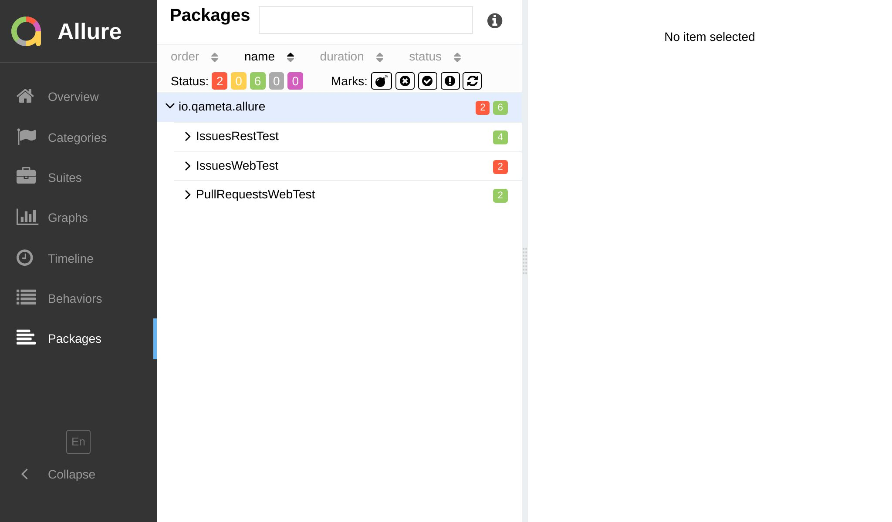

import Tabs from '@theme/Tabs';
import TabItem from '@theme/TabItem';

# By Package



This grouping feature is the least helpful outside of Java world, where packages are used to organize the codebase.

It strictly follows `com.example.package.ClassName` naming convention, where:

* `com.example.package` is a **package**,
* `com.example.package.ClassName` is a **test class**,
* `shouldAssertAndDoSomething` is a **test method**.

It doesn't map well to JavaScript
[⁽¹⁾](https://github.com/orgs/allure-framework/discussions/2027).
Hence, normally you'll be able to utilize only two grouping levels: **package** and **test method**.


A couple of feasible options are:

* use `package` to group tests by `package.json` name;
* use `package` to group tests by the file path;
* use `testMethod` to group tests by the full test name

<Tabs groupId="configTab">
  <TabItem value="config" label="Config">

```js title="jest.config.js"
/** @type {import('@jest/types').Config.InitialOptions} */
module.exports = {
  testEnvironment: 'jest-allure2-reporter/environment-node',
  reporters: [
    'default',
    ['jest-allure2-reporter', /** @type {import('jest-allure2-reporter').ReporterOptions}*/ {
      labels: {
        package: ({ manifest }) => manifest.name,
        // ⚠️ `testClass` won't work due to the aforementioned issue
        testClass: ({ file }) => file.path,
        testMethod: ({ test }) => test.fullName,
      },
    }],
  ],
};
```

  </TabItem>
  <TabItem value="demo" label="Preview">

```plain
└─ @my-company/my-package
   ├─ Forgot password controller should return 401 if password is incorrect
   ├─ Forgot password controller should return 401 if user is not found
   ├─ Forgot password screen when loaded and typed should validate e-mail
   ├─ Forgot password screen when loaded should display forgot password form
   ├─ Login controller should return 401 if password is incorrect
   ├─ Login controller should return 401 if user is not found
   ├─ Login screen when loaded and typed should validate password
   ├─ Login screen when loaded and typed should validate password
   └─ Login screen when loaded should display login form
```

  </TabItem>
</Tabs>

## Achieving three levels

:::info Disclaimer

The example below is simplified and does not handle edge cases like folder names with spaces, and other non-alphanumeric characters.

:::

So, especially curious souls may try this hacky configuration to get all three levels,
but it's an open question whether it's worth the effort:

```js title="jest.config.js"
/** @type {import('@jest/types').Config.InitialOptions} */
module.exports = {
  testEnvironment: 'jest-allure2-reporter/environment-node',
  reporters: [
    'default',
    ['jest-allure2-reporter',
    /** @type {import('jest-allure2-reporter').ReporterOptions}*/
    {
      labels: {
        package: ({ filePath }) => filePath.slice(0, -1).join('.'),
        testClass: ({ filePath }) => filePath.join('.').replace(/\.test\.[jt]s$/, ''),
        testMethod: ({ testCase }) => testCase.fullName,
      },
    }],
  ],
};
```

This example is a proof of concept to help you understand better how this grouping strategy was supposed to work in the first place.
It demonstrates that if you map file paths like `src/components/MyComponent.test.js` to pseudo-classes like `src.components.MyComponent`,
the generated report will recognize these labels and group tests accordingly.
