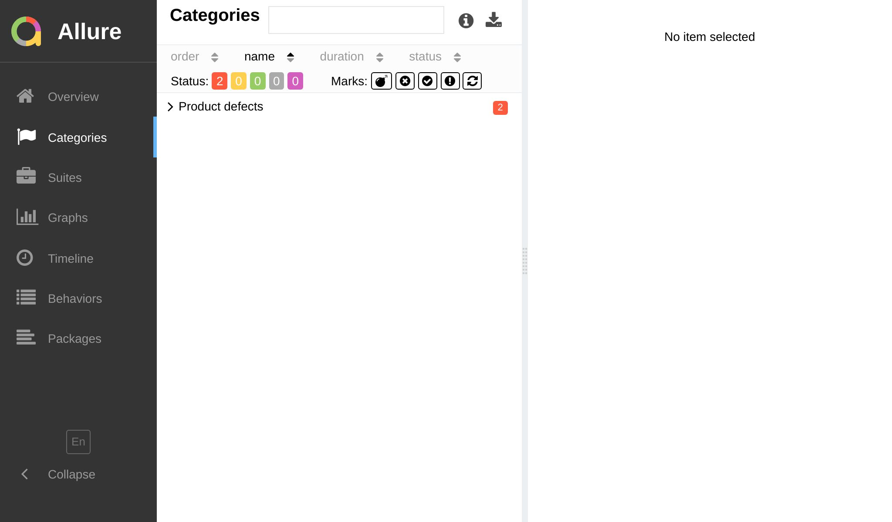

import Tabs from '@theme/Tabs';
import TabItem from '@theme/TabItem';

# By Category

:::caution

This website version refers to the unreleased version of `jest-allure2-reporter`, partially available as `2.0.0-alpha.*` release.
Please use GitHub docs for the latest stable version, `1.x.x`.

:::



One of the most important things when your builds start failing is to understand _what exactly is broken_.

By defining **test result categories**, you can easily distinguish between different types of errors and failures.

There are two built-in categories for test results:

<dl>
  <dt>
    <b>🔴 &nbsp;Product defect</b>
  </dt>
  <dd>A failed Jest assertion, e.g. <code>expect(countOfPosts).toBe(1)</code>.</dd>
  <dt>
    <b>🟡 &nbsp;Test defect</b>
  </dt>
  <dd>A broken test, e.g. <code>TypeError: Cannot read property 'foo' of undefined</code>, timeout or syntax errors.</dd>
</dl>

This doesn't mean that you can't have categories for 🟢 _passed_ or ⚪ _skipped_ tests, but usually it makes more sense
to  develop a comprehensive taxonomy for various failure types.

For example, you can also distinguish between **Visual regression**, **Timeout error** and as many others as you need.

```js title="jest.config.js"
/**
 * @type {import('@jest/types').Config.InitialOptions}
 */
module.exports = {
  // ... your jest config
  reporters: [
    'default',
    ['jest-allure2-reporter',
      /** @type {import('jest-allure2-reporter').JestAllure2ReporterOptions} */
      {
// highlight-start
        categories: [
          {
            name: "Visual Regression",
            // optional `matchedStatuses`
            matchedStatuses: ["failed"],
            // optional `messageRegex`
            messageRegex: "Expected .*to match a screenshot.*",
            // optional `traceRegex`
            traceRegex: ".*visual-regression.*",
          },
          //
          // ... other categories
          //
        ],
// highlight-end
      }
    ],
  ],
};
```

:::tip

If you need to overwrite the default categories, use a function customizer instead of an array:

```js title="jest.config.js"
module.exports = {
  // ... your jest config
  reporters: [
    'default',
    ['jest-allure2-reporter',
      /** @type {import('jest-allure2-reporter').JestAllure2ReporterOptions} */
      {
// highlight-start
        categories: () => [/* ... */],
// highlight-end
      }
    ],
  ],
};
```

:::
