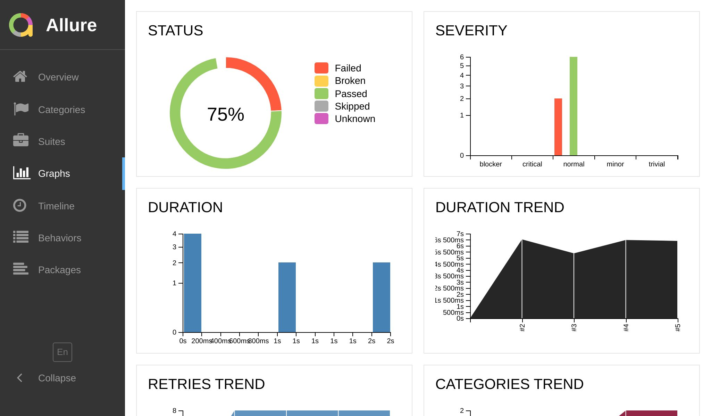
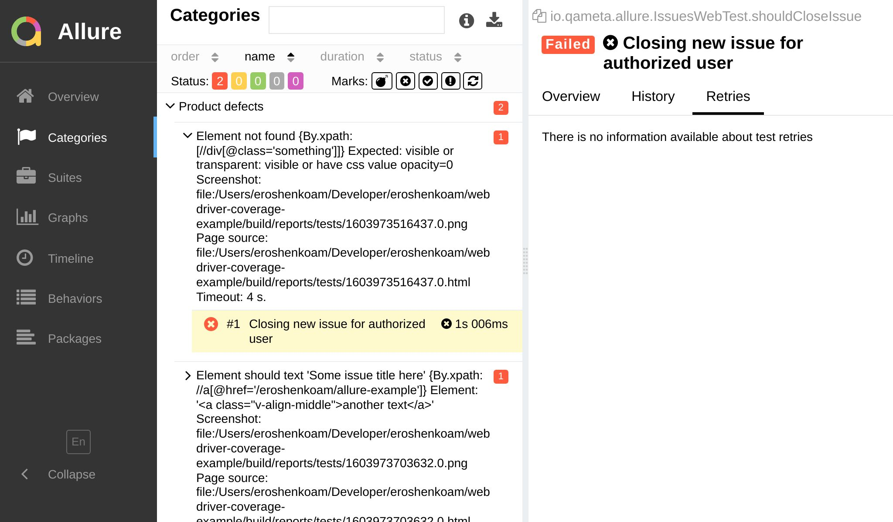

---

description: Monitor long-term trends in your test execution.
---

# History



One of notable features of Allure 2 is the ability to monitor _test retries_ and _long-term trends_ in your test execution.
This is an easy way to spot flaky tests and track the overall health of your test suite.
We'll discuss each of these features in detail below.

## Test Retries

Jest provides a feature called [`jest.retryTimes(n)`][jest.retry] &mdash;
this is useful when your tests or your test environment are not reliable enough, and you want
to run each failed test multiple times hoping that it will pass eventually.



The test retry feature is automatically enabled with `jest-allure2-reporter`, requiring no additional configuration on your part.

If some of your tests didn't pass on the first time, you'll
see 
immediately in the reports. Inside **Retries** tab you can click on the previous recorded attempts
and inspect all the necessary details of their execution.

:::tip

If you attempt to retry your tests using unconventional methods, such as
running `jest` multiple times, you'll need to make sure that you don't delete the
`allure-results` directory between the runs:

```js title="jest.config.js"
/** @type {import('@jest/types').Config.InitialOptions} */
module.exports = {
  // ...
  reporters: [
    // ...
    ['jest-allure2-reporter', {
// highlight-next-line
      overwriteResultsDir: false,
    }]
  ],
};
```

Still, this is not a recommended way to do it due to performance reasons and potential conflicts
with [Executor] and [Environment] information, which are not designed to be collected multiple times.

:::

## Trends


_Long-term trends_ are the ability to track test execution history over time and analyze it.

On the **Graphs** page, you can see all available trends, and on the **Overview** page, you can see
the **History Trend**.

:::tip

All charts are interactive, and you can click on them to see the details of a particular test run,
provided that you have configured [Executor] information.

:::

<details>
<summary>Click to see all built-in trends</summary>
<dl>
  <dt><strong>History Trend</strong></dt>
  <dd>
    
    Shows the number of passed and failed tests over time.
  </dd>
  <dt><strong>Duration trend</strong></dt>
  <dd>
    
    Shows the average duration of test runs over time.
  </dd>
  <dt><strong>Retries trend</strong></dt>
  <dd>
    
    Helps to see whether your tests become more or less reliable over time.
  </dd>
  <dt><strong>Categories trend</strong></dt>
  <dd>
    
    Provides a breakdown of test defects by categories.
  </dd>
</dl>
</details>

## Test Case ID

To make the history feature work in an environment where tests can be renamed,
skipped, or moved around, Allure 2 Framework needs a way to identify tests
across multiple test runs in the past, present, and future.

The property behind test identification is `testCaseId` &mdash; a unique identifier
generated for each test[^1]. When Allure 2 framework aggregates reports from multiple
test runs in the past, this identifier is the only way to tell which tests are the same,
and which are different.

So, when **Test A** and **Test B** are considered the same,
what does that _actually_ mean? The answer may vary on your project specifics
and the way you write tests. Ask yourself: are two tests the same...

* if they have the same name but are located in different files?
* if they have the same name and file name, but the source code has changed?
* if their order of execution is different (e.g. you moved a test a few lines up or down, and now it's executed before another test)?

Well, the _default behavior_ of `jest-allure2-reporter` is to consider tests the same if they
are located in the _same file_ (relative POSIX path) and have the _same name_.
This is the most common case, and it works well for most projects.

If you want to change this behavior, you can use the `testCaseId` option:

```js title="jest.config.js"
const { createHash } = require('crypto');
const md5 = (data) => createHash('md5').update(data).digest('hex');

/** @type {import('@jest/types').Config.InitialOptions} */
module.exports = {
  // ...
  reporters: [
    // ...
    ['jest-allure2-reporter', {
      testCaseId: ({ package, file, test }) => {
        return md5(`${package.name}:${file.path.posix}:${test.fullName}`);
      },
    }]
  ],
};
```

## Keeping History

As much as the history feature sounds awesome, it doesn't work out of the box &mdash;
unless you do some extra work to keep the history files around.

By default, `allure generate` command generates just a single report without any history.
Upon closer inspection, this isn't entirely accurate.
Within the `allure-report/history` directory, the Allure 2 Framework puts a few JSON files
encapsulating your test execution history:

```plain
categories-trend.json
duration-trend.json
history-trend.json
history.json
retry-trend.json
```

These history files are important to keep.
Before generating the next report, you'll need to copy the history files from the
`allure-report/history` directory of the previous report to the `allure-results/history` directory[^2],
e.g.:

```sh
cp -r allure-report/history allure-results/
```

Now, when you run `allure generate`, it will generate a report with the history of the previous run.

To reiterate, for generating the third report &mdash;
which includes the history of the first and second runs &mdash;
once again, you need to copy `allure-report/history` to `allure-results/history`,
followed by executing the `allure generate` command.

In other words, it is similar to `reduce` chaining concept:

```js
function makeReport(allureReportHistory, allureResults) {
  return // ... make a report
}

const report1 = makeReport(null, results1);
const report2 = makeReport(report1.history, results2);
const report3 = makeReport(report2.history, results3);
// ... and so on
```

This is why you'll just need to keep the history files from the **last** (not every!) report.
As long as you keep putting them into `allure-results/history` directory, you'll be able to
trace the history of your previous test runs.

## Automating History

While this issue largely falls outside the scope of this project,
it is clear that copying history files manually is not a sustainable solution.
A more efficient approach could be to automate this process with a script or use the
[Allure Docker Service][fescobar/allure-docker-service], which is designed for tasks like this.

The latter provides a Docker container that runs Allure 2 Framework with some REST API
on top of it. You will be able to maintain multiple projects, send test results via POST requests,
and access your reports via web UI with the history and other server-dependent features.

## Summary

Effectively setting up and managing history in Allure 2 Framework may require an initial investment of time and effort.

However, it becomes an invaluable asset, especially for larger teams and extensive projects, aiding in long-term trend analysis and overall test management.
Once you have a solid understanding of the more basic features of the framework, it's highly recommended to revisit and establish history tracking for your project.

[jest.retry]: https://jestjs.io/docs/jest-object#jestretrytimesnumretries-options
[Executor]: 05-executor.mdx
[Environment]: 04-environment.mdx
[fescobar/allure-docker-service]: https://github.com/fescobar/allure-docker-service

[^1]: For clarity, test and test case are being used interchangeably &mdash; here and there we refer
to `test('...', () => {})` and `it('should ...'. () => {})` statements in Jest.
[^2]: Please note directory names &mdash; `allure-report/history` and `allure-results/history`
are not the same &mdash; the former is a directory with HTML files, the latter is a directory
with JSON files containing pure data not rendered yet.
